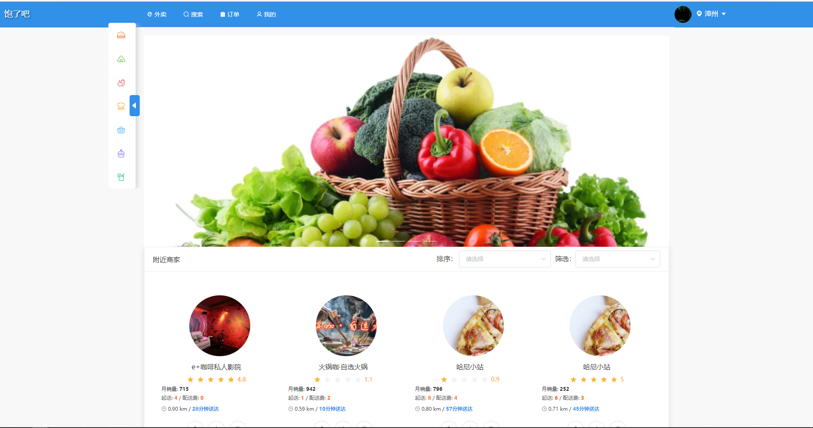

# blb-consumer-frontend

来源于:<https://github.com/0xcaffebabe/blb> 微服务后端项目

消费者前端越做越大 于是干脆就把消费者前端独立出来 成为一个独立的项目

在线预览：<https://blb.ismy.wang>

## 使用

```sh
npm install # 安装依赖
npm run mock # 启动mock服务器
npm run dev # 启动web服务器
```

访问localhost:8080即可

## 部分截图




## 页面

- [ ] 公共组件
  - [ ] 顶部导航栏
    - [ ] 城市选择器
    - [ ] 头像点击组件
    - [ ] 登录注册组件
  - [ ] 侧边导航栏
  - [ ] 商家列表
    - [ ] 排序筛选选择器
  - [ ] 订单商品列表
  - [ ] 订单项组件
  - [ ] 聊天组件
- [ ] 首页
  - [ ] 轮播组件
- [ ] 店铺页
  - [ ] 店铺头
  - [ ] 店铺详情
    - [ ] 商品
      - [ ] 商品列表
    - [ ] 评价
    - [ ] 商家
  - [ ] 店铺侧边栏
    - [ ] 购物车抽屉
- [ ] 确认下单页
- [ ] 支付页
- [ ] 搜索页
  - [ ] 店铺搜索框
- [ ] 订单列表页
  - [ ] 订单详情
  - [ ] 订单评价
- [ ] 我的页
  - [ ] 个人资料编辑
    - [ ] 收货地址编辑
    - [ ] 个人信息编辑
  - [ ] 会员购买组件
  - [ ] 账户余额组件
  - [ ] 优惠券组件
- [ ] 客服中心页
  - [ ] 提交投诉组件
  - [ ] 投诉详情组件
- [ ] 积分商城页
